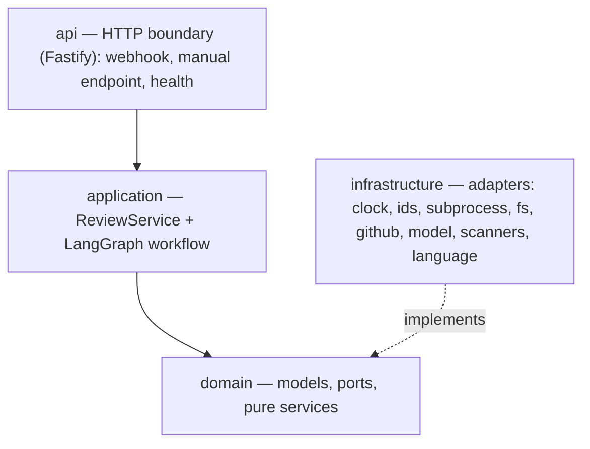
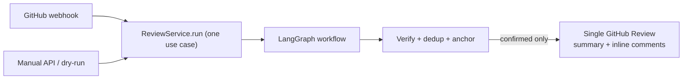

# Architecture

## Overview

Bicho analyzes a GitHub Pull Request and publishes a single review with inline comments. It is a
**single stateless container** with **no database**: GitHub itself is the source of truth for what
has already been reviewed. The same use case runs from two entrypoints — an automatic **webhook**
and a manual **API** call — so there is one code path, not two.

## Layers and the dependency rule



**`api → application → domain ← infrastructure`.** The domain imports nothing framework-specific.
`@langchain/*` appears only in `application` and `infrastructure/model`; `fastify`, `jose`,
`oxc-parser`, `node:child_process` and the filesystem appear only in `infrastructure` and `api`.
Everything with a side effect (clock, randomness, subprocess, filesystem, network) sits behind a
**port** (an interface in `domain/ports/`) with an injectable implementation — which is what makes
the whole suite deterministic and 100%-coverable offline.

## Map

```
src/
  main.ts                 Process entrypoint.
  api/                    HTTP boundary: app factory, container, routes, webhook, background runner.
  config/                 Settings (Zod over a BICHO_-prefixed environment), logging, readiness.
  domain/                 Framework-free core: models, errors, ports, pure services.
  infrastructure/         Adapters implementing the ports.
  application/            The ReviewService use case, the LangGraph workflow, and the analyzers.
tests/                    unit/ · property/ · e2e/ ; helpers/ holds shared factories and fakes.
resources/semgrep/        Curated local Semgrep rules shipped in-repo.
```

## Review pipeline



The workflow is a linear spine into a single parallel fan-out superstep, fanned back in via a
concatenating reducer, then a gated linear finish:

```
fetch_pull_request → fetch_changed_files → normalize_diff → detect_language
  → gather_file_contents → select_analyzers
  ─fan-out→ { correctness · security · performance · maintainability · tests · contracts
              · semgrep · npm-audit }  → collect_findings   ←fan-in
  → verify_findings → compose_review
  → idempotency_guard ─cond→ stale_head_guard ─cond→ publish_github_review → END
```

Its load-bearing invariant: because a thrown exception in a parallel superstep rolls the **whole**
superstep back, every scanner/analyzer node is wrapped by `resilientOutcome` so it **degrades to a
diagnostic instead of throwing**. The manual and webhook paths run the *same* graph; only
`ReviewOptions` (`dryRun` / `force` / `focus` / `categories`) differ.

## Notable design choices in this port

These are where the TypeScript implementation had to make a decision the Python original did not.

- **State channels.** Python's `TypedDict` with `Annotated[list, operator.add]` maps to LangGraph's
  `Annotation.Root` with an explicit reducer. Only `outcomes` is reducer-backed; every other key has
  a single writer on the spine. Zod is reserved for real validation boundaries (environment, model
  output, GitHub payloads, HTTP bodies) rather than internal graph plumbing.
- **Frozen models.** Pydantic's `frozen=True` + `model_copy(update=…)` becomes `readonly` types plus
  a validating `withFinding(finding, update)` helper, so an update that breaks an invariant still
  fails loudly. Findings stay plain data because they travel through graph state.
- **Resource cleanup.** Python's `with workspace.create()` becomes `await using`, so a sandboxed
  temp directory is removed on both the success and failure paths.
- **Structured output.** Function calling, not JSON mode — third-party OpenAI-compatible endpoints
  do not reliably honour `response_format`. A parse failure is returned as data, never thrown.
- **Symbol resolution.** Python used the stdlib `ast`. TypeScript 7 exposes its parser only behind
  an explicitly *unstable* entrypoint, so the language adapter uses `oxc-parser` — see
  [ADR-0011](docs/adr/0011-oxc-parser-for-symbol-resolution.md).
- **Raw webhook body.** Fastify parses JSON before handlers run, which would defeat verifying the
  HMAC over the exact bytes GitHub signed. One content-type parser hands the webhook route the raw
  `Buffer` and every other route ordinary parsed JSON.

## Key decisions

See [docs/adr/](docs/adr/). The load-bearing ones: no database (GitHub as source of truth) · single
container with in-process background tasks · 100% coverage and TDD · a language-agnostic core with
adapters · the model-provider abstraction · one review via an idempotency marker and stale-head
guard · deterministic scanners · TypeScript as the primary analysis target.

## Limitations

Deliberate constraints (non-durable background tasks, single instance, no exactly-once) are
documented honestly in [docs/limitations.md](docs/limitations.md).
