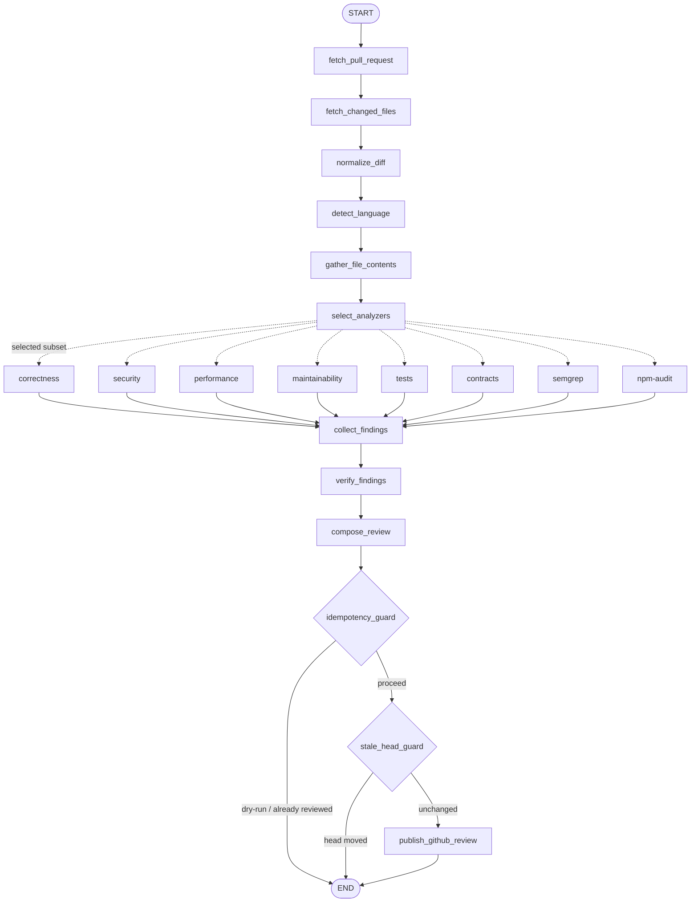

# Bicho PR Reviewer

> Automated GitHub Pull Request review agent — it gathers PR context, runs deterministic scanners
> (Semgrep CE, `npm audit`) plus LLM-based specialized analyzers, **verifies** findings to cut false
> positives, and publishes a **single** GitHub Review: an executive summary plus multiple **inline
> comments** anchored to the exact file/line/range. *(bicho — Spanish for "critter".)*

Two kinds of review in one pass: deterministic scanners catch the *known* (advisories, injection
patterns), specialized LLM analyzers catch the *contextual* — and a verifier gate keeps either from
posting noise. A reviewer that confidently invents problems is worse than none.

This is the **Node + TypeScript** implementation. It is a port of
[bicho-pr-reviewer](https://github.com/pablojacobi/bicho-pr-reviewer) (Python/FastAPI/LangGraph),
preserving its architecture, its invariants, and its testing discipline, while moving the *analysis
target* from Python to TypeScript/JavaScript — see
[ADR-0010](docs/adr/0010-typescript-as-the-primary-analysis-target.md).

## What it does

- Triggers automatically on a GitHub App **webhook** (PR opened / reopened / synchronize / ready for
  review) and runs the analysis as an in-process background task — or on demand via a **manual API
  endpoint** (`POST /reviews`) with `dryRun` to preview the review without posting.
- Routes the diff through a typed **LangGraph** workflow with fan-out/fan-in over deterministic
  scanners (**Semgrep CE**, **`npm audit`**) and six specialized LLM analyzers (correctness,
  security, performance, maintainability, tests, contracts), then a **verifier** that reduces false
  positives.
- Publishes **one** GitHub Review with inline comments — each with category, severity, explanation,
  impact and a recommendation. Findings that can't be anchored to the diff go into the summary.
  Idempotency (a hidden marker) and a stale-head guard prevent duplicate or misplaced reviews.

## The pipeline

A linear spine fans out into one parallel superstep (six LLM analyzers + two deterministic
scanners), fans back in via a concatenating reducer, then a gated publish tail. Every fan-out node
degrades to a diagnostic instead of throwing, so one failure never rolls back the superstep.



## Stack

Node 24+ (ESM) · TypeScript 7 (strict) · Fastify 5 · Zod 4 · LangGraph 1.4 · pino 10 · jose 6 ·
oxc-parser · Vitest 4 (100% line + branch gate) · fast-check · msw · Biome 2.

## Quick start

```bash
npm install
cp .env.example .env      # fill in the GitHub App and model provider values
npm test                  # tests + the 100% coverage gate
npm run dev               # http://127.0.0.1:8000
```

Preview a review without posting anything:

```bash
curl -X POST localhost:8000/reviews \
  -H 'content-type: application/json' \
  -d '{"repository":"octo/hello-world","prNumber":42,"dryRun":true}'
```

It returns the composed draft — the summary and the inline comments that *would* be posted.

## Commands

```bash
npm test           # Vitest + 100% line/branch/function/statement gate
npm run typecheck  # tsc --noEmit, strict
npm run lint       # Biome (lint + format check)
npm run build      # compile to dist/
docker build -t bicho .
```

## Endpoints

| Method | Path               | Purpose                                                     |
| ------ | ------------------ | ----------------------------------------------------------- |
| `POST` | `/reviews`         | Run a review for a PR (`dryRun` defaults to `true`)          |
| `POST` | `/webhooks/github` | GitHub App webhook; verifies HMAC, returns 202 immediately   |
| `GET`  | `/healthz`         | Liveness — the process is up                                 |
| `GET`  | `/readyz`          | Readiness — required configuration is present (503 if not)   |
| `GET`  | `/version`         | App, workflow and prompt versions stamped into review markers |

## Configuration

Every setting is read from the environment with the `BICHO_` prefix; nested sections use a `__`
delimiter (`BICHO_GITHUB__APP_ID`). See [.env.example](.env.example) for the full reference. The
contract is identical to the Python implementation, so a single environment configures either.

Several model providers can be configured at once, each under its own name, with `BICHO_LLM__ACTIVE`
selecting the one in use — adding a model is a new provider block plus flipping `ACTIVE`, never
swapping keys.

## Documentation

[Architecture](ARCHITECTURE.md) · [Contributor and agent guide](AGENTS.md) ·
[ADRs](docs/adr/) · [Security policy](SECURITY.md) · [Limitations](docs/limitations.md)

## License

[MIT](LICENSE).
